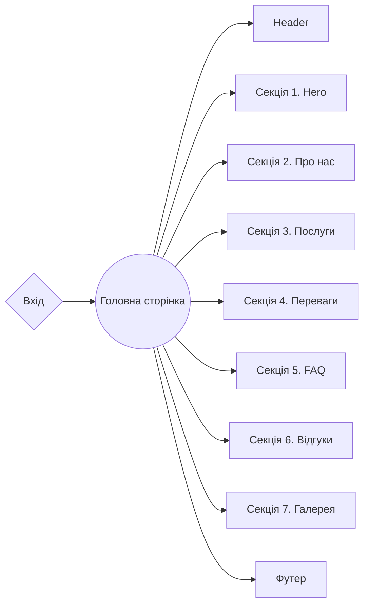

# Template NextJs+Tailwind :tada::white_flower::cherry_blossom::candy:

**[Переглянути живу сторінку](https://gift-studio.vercel.app/)**

### Структура проєкту

<details>

<summary><b>Організація проєкту та Розташування Файлів: </b></summary>
<br/>

```

|-- public -> статичні файли
|-- admin -> директорія із базовим кодом CMS
  |-- requests --> отримання динамічних даних
  |-- schemas --> схеми моделювання
  даних CMS
|-- src -> директорія із вихідним кодом основної
програми
  |-- app ->  маршрутизація
    |-- (site) --> група маршрутів для
    головного інтерфейсу
    |-- (studio) --> група маршрутів для вбудованої CMS
  |-- components -> директорія зі зручними компонентами
    |-- NameComponent -> базові компоненти
    секцій/блоків (слайдер і т.д.)
    |-- ui -> невеликі, зручні компоненти
    (кнопки, логотипи і т.д.)
      |-- NameComponent -> папка для кожного компонента
        |-- NameComponent.tsx -> основний компонент
        |-- index.ts -> файл для повторного
        експорту
        |-- types.ts -> файл для спеціальних типів компонентів (параметри)
  |-- layout -> компоненти, які використовуються як основний шаблон
  |-- sections ->
  директорія із компонентами секцій
  |-- data -> статичні дані для проєкту (json)
  |-- types -> директорія
  зі зручними визначеннями типів
  |-- utils -> додаткові, зручні функції для сторінок та компонентів
  |-- constants -> директорія із константами

```

</details>

## 🧩 Технології

### Frontend

- **Next.js**: Фреймворк React для розробки високопродуктивних веб-сайтів та
  застосунків.
- **TypeScript**: Мова програмування, яка додає статичний аналіз типів до
  JavaScript.

### Стилізація

- **Tailwind CSS**: Утиліта для створення власних дизайнів інтерфейсу,
  використовуючи лише HTML та CSS.

### CMS

- **Sanity**: Headless CMS для створення, управління та доставки цифрових
  змістів.

### Бібліотеки

- **Swiper**: Сучасна бібліотека для роботи зі слайдерами та каруселями.
- **React Scroll**: Бібліотека для реалізації плавного прокручування до розділів
  сайту.

### Структура проєкту



## ☎️ Контакти

**Example** готовий відповісти на ваші питання та надати додаткову інформацію:

- **Веб-сайт**: [www.example.com](https://www.example.com/)
- **Телефон**: <a href="tel:+3809999">+380987654321</a>
- **Електронна пошта**: [example@example.com](mailto:example@example.com)
